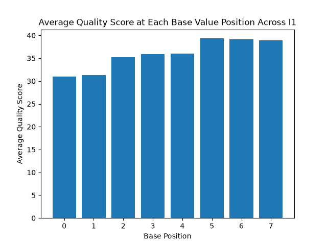
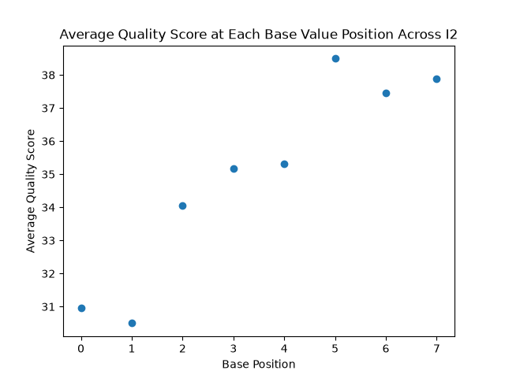
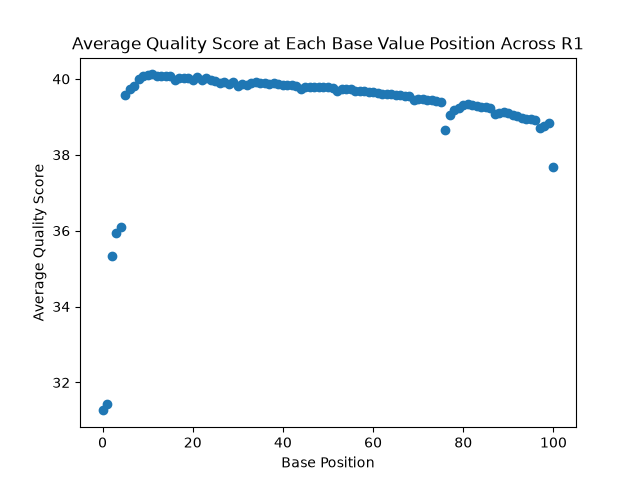
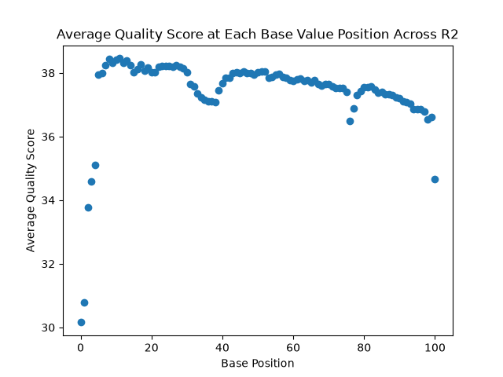

# Assignment the First

Link to current lab notebook: https://github.com/adrianylee/bgmp-Lab-Notebook/blob/main/Demultiplex.md

## Part 1
1. Be sure to upload your Python script. Provide a link to it here:
[qualityScoreDistribution.py](qualityScoreDistribution.py)

| File name | label | Read length | Phred encoding |
|---|---|---|---|
| 1294_S1_L008_R1_001.fastq.gz | read1 | 101 | phred33 |
| 1294_S1_L008_R2_001.fastq.gz | index1 | 8 | 33 |
| 1294_S1_L008_R3_001.fastq.gz | index2 | 8 | 33 |
| 1294_S1_L008_R4_001.fastq.gz | read2 | 101 | 33 |

2. Per-base NT distribution
    1.     
    2. I think a Q30 cutoff score is very reasonable for this Illumina data. A Q30 is a 99.9% accuracy rate. Since the indexes are very short, a higher quality cutoff of at least 30 must be used to minimize the amount of errors that could contaminate downstream analysis. A Q40 cutoff is too strict for this. Based on the average quality score distribution, a Q30 cutoff makes sense since it includes the mean quality score of all positions (lots of data + gets rid of horrible outliers).
    3. Index (for R1) with N base calls: 3976613
       Index (for R2) with N base calls: 3328051
       Commands used:
       ```
       zcat /projects/bgmp/shared/2017_sequencing/1294_S1_L008_R3_001.fastq.gz | grep -A 1 "^@" | grep -v "^@" | grep -c "N"
       zcat /projects/bgmp/shared/2017_sequencing/1294_S1_L008_R2_001.fastq.gz | grep -A 1 "^@" | grep -v "^@" | grep -c "N"
       ```
    
## Part 2
1. Define the problem
2. Describe output
3. Upload your [4 input FASTQ files](../TEST-input_FASTQ) and your [>=6 expected output FASTQ files](../TEST-output_FASTQ).
4. Pseudocode
5. High level functions. For each function, be sure to include:
    1. Description/doc string
    2. Function headers (name and parameters)
    3. Test examples for individual functions
    4. Return statement
